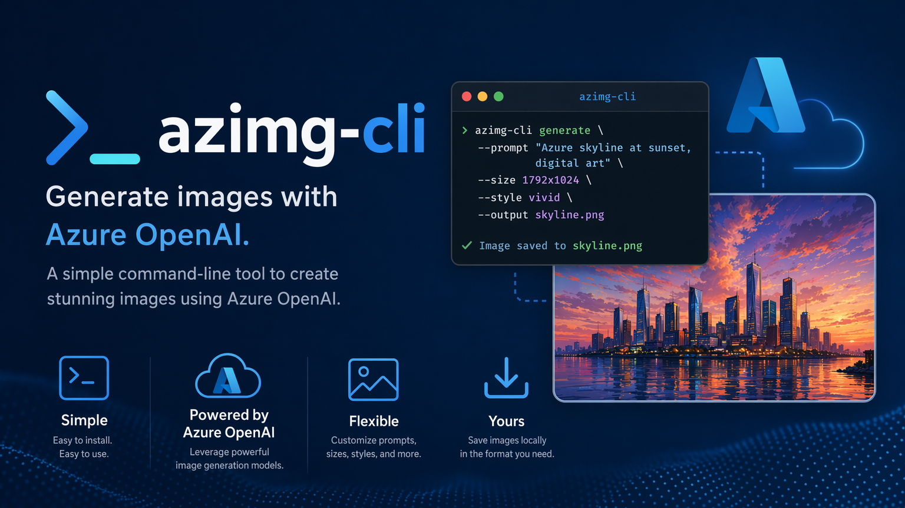

# AzImg CLI

AzImg CLI is a non-interactive tool for Azure OpenAI image generation and editing.
The executable command is `azimg`.



## ✨ Key features

- Non-interactive by default for agents, scripts, CI, and unattended shells.
- Azure OpenAI image generation and image editing workflows.
- Local config profiles for endpoint, deployment, and output directory defaults.
- Optional manifests with paths, checksums, usage, deployment, and timestamps.
- Installable agent skill that helps AI agents use `azimg` correctly.

## 📦 Installation

Supported release platforms:

- Windows x64: `win-x64`
- Windows ARM64: `win-arm64`
- macOS Apple Silicon: `osx-arm64`
- Linux x64: `linux-x64`

### macOS and Linux

```bash
curl -fsSL \
  https://raw.githubusercontent.com/Jcardif/azimg-cli/main/install.sh | bash
```

### Windows PowerShell

```powershell
iwr https://raw.githubusercontent.com/Jcardif/azimg-cli/main/install.ps1 `
  -UseB | iex
```

### Agent skill

The CLI ships with an agent skill for AI agents.

It helps them use `azimg` for image generation and editing. Install it with:

```bash
azimg install-skill --format text
```

The command downloads `skills/azimg/SKILL.md` from GitHub by default.

It uses the current CLI version tag and reports the source URL.

It saves the skill to `~/.agents/skills/azimg/SKILL.md`.

Use `--ref main` to install the latest committed skill from the default branch.

## 🔐 Authentication

AzImg CLI uses the current Azure CLI sign-in via `az account get-access-token`;
token storage is delegated to Azure CLI.

```bash
# Login via Azure CLI first
az login

# Verify authentication with azimg doctor
azimg doctor --verify-auth
```

The authenticated identity needs the `Cognitive Services OpenAI User` role.
Assign it on the Azure OpenAI resource.

To assign the role via Azure CLI:

```bash
resource_id="/subscriptions/<sub>/resourceGroups/<rg>"
resource_id="$resource_id/providers/Microsoft.CognitiveServices"
resource_id="$resource_id/accounts/<resource>"

az role assignment create \
  --assignee "<your-user-or-service-principal>" \
  --role "Cognitive Services OpenAI User" \
  --scope "$resource_id"
```

## 🚀 Usage example

Generate the `azimg-cli` repository banner:

```bash
prompt="Generate a banner image 16:9 for a repo for azimg-cli,"
prompt="$prompt a command-line tool that generates images with Azure OpenAI."

azimg generate \
  "$prompt" \
  --profile azure-default \
  --count 1 \
  --size 1536x864 \
  --quality high \
  --background opaque \
  --output-format png \
  --output-directory ./output/banner \
  --name-template azimg-cli-banner \
  --write-manifest \
  --format text
```

This writes the banner image and manifest to `./output/banner`.

## ⚙️ Configuration and common settings

The default configuration file is `~/.azimg/config.json`.
Run `azimg config init --force`, then edit endpoint and deployment.

```json
{
  "schemaVersion": 1,
  "defaultProfile": "azure-default",
  "profiles": {
    "azure-default": {
      "deployment": "gpt-image-2",
      "endpoint": "https://your-resource.openai.azure.com/",
      "outputDirectory": "~/.azimg/output"
    }
  }
}
```

## 📚 Command reference

Command responses are JSON by default.
Add `--format text` when you want human-readable output.

Run `azimg <command> --help` for the canonical help text.
Commands below omit the leading `azimg` unless the command is global.

| Command | Purpose | Required input |
| --- | --- | --- |
| `--help` | Show top-level help. | None. |
| `<command> --help` | Show command help. | Command name. |
| `generate <PROMPT>` | Generate images from text. | One quoted prompt. |
| `edit <FILE> <PROMPT>` | Edit an image. | File and prompt. |
| `doctor` | Validate config and output setup. | None. |
| `config` or `config show` | Print the current config. | None. |
| `config init` | Create a starter config. | None. |
| `config set-default-profile` | Set default profile. | `--profile <NAME>` |
| `install-skill` | Install the AzImg agent skill. | None. |
| `update check` | Check for a newer release. | None. |
| `update` or `update apply` | Install the selected release. | None. |
| `version` | Print version information. | None. |

### Profile and Azure options

Use these with `generate`, `edit`, and `doctor` to override a config profile.

- `-p, --profile <NAME>`: Use a named profile from the config file.
- `--config <PATH>`: Read a config file other than `~/.azimg/config.json`.
- `--deployment <NAME>`: Override the Azure OpenAI deployment name.
- `--endpoint <URL>`: Override the Azure OpenAI endpoint.
- `-o, --output-directory <PATH>`: Override where generated files are written.

### Image generation and edit options

Use these with `generate` and `edit`.

- `--count <N>`: Number of images to create, from `1` to `10`.
- `--size <WIDTHxHEIGHT>`: Image size, such as `1024x1024`.
- `--quality <auto|low|medium|high>`: Requested image quality.
- `--background <auto|opaque|transparent>`: Requested background mode.
- `--output-format <png|jpeg|webp>`: Saved image format.
- `--output-compression <0-100>`: Compression level for supported formats.
- `--end-user-id <ID>`: Optional user identifier passed to the service.
- `--name-template <TEMPLATE>`: File name template.
- Tokens: `{timestamp}`, `{id}`, `{slug}`, `{index}`, and `{profile}`.
- `--write-manifest`: Write a manifest JSON file beside the images.
- `--mask-file <PATH>`: PNG mask for `edit` only.

### Config options

- `config` defaults to `config show`.
- `config init --force` overwrites an existing config file.
- `config set-default-profile --profile <NAME>` changes the default profile.
- `--path <PATH>` reads or writes a specific config file.
- `--action <ACTION>` selects the action by option instead of position.

### Update options

- `update` defaults to `update apply`.
- `update install` is an alias for `update apply`.
- `--version <TAG>` selects a specific release instead of the latest release.
- `--install-dir <PATH>` selects the directory that contains `azimg`.
- `--manifest-url <URL>` uses an explicit release manifest.
- `--dry-run` previews update work without changing files.
- `--force` reinstalls even when the selected release is already current.

### Agent skill options

- `install-skill` downloads and installs the AzImg skill.
- `--install-dir <PATH>` selects the agent skills root directory.
- `--ref <BRANCH|TAG|SHA>` selects the GitHub ref for `SKILL.md`.
- `--source-url <URL>` downloads `SKILL.md` from an explicit URL.
- `--dry-run` previews the download source and save path.
- `--force` overwrites an existing different `SKILL.md` file.

### Output formatting

- `--format json` is the default for structured command output.
- `--format text` prints human-readable output.

## 🧑‍💻 Development

For development, restore dependencies, build, test, and smoke-test the CLI:

```bash
git clone https://github.com/Jcardif/azimg-cli.git
cd azimg-cli

dotnet restore AzImg.Cli.slnx
dotnet build AzImg.Cli.slnx --configuration Release --no-restore
dotnet test AzImg.Cli.slnx --configuration Release --no-build

dotnet run --project src/AzImg.Cli doctor
dotnet run --project src/AzImg.Cli version
```

## 📝 Release notes

Release notes live in `docs/release-notes/<tag>.md`.

## ⚖️ License

This project is licensed under the MIT License.
